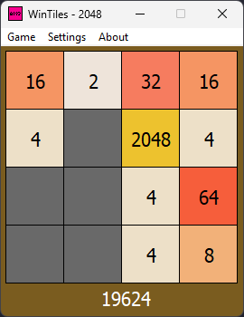
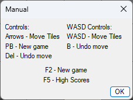

# WinTiles - A game of 1024/2048/4096/8192 for Windows written in C++11




## Features
* Selection of limit (1024/2048/4096/8192)
* Auto-save when closed
* High scores (5 positions)

## Requirements for pre-compiled binaries
* Windows 7 SP1 or newer
* [Microsoft Visual C++ Redistributable 2022](https://learn.microsoft.com/en-US/cpp/windows/latest-supported-vc-redist)
* CPU with POPCNT (only for x64 builds; most CPUs released after 2008)

Pre-compiled binaries are built with the latest (at the time of the release) stable version of Visual Studio 2022.
x64 binaries are compiled with clang-cl, while x86 ones are compiled with cl.
Build flags are the same as in CMakeLists.txt

## Building
Note: These instructions are for creating builds which replicate the pre-compiled binaries.

Usage of POPCNT can be disabled by adding 'NO_POPCNT' to compile definitions in CMakeLists.txt
### Requirements for build

* Visual Studio (tested with 2022) with "Desktop Development with C++" workload installed
* CMake 3.25+ (included with current versions of VS 2022; earlier versions of CMake may work after change in
  CMakeLists.txt, but
  I didn't test)

### How to build

1. Download or clone this repository
2. Open Developer PowerShell for VS 2022
3. Change directory (cd) to the path containing source tree
4. Type:

```powershell
mkdir build
cd build
cmake -G "Visual Studio 17 2022" ..
msbuild WinTiles.sln /p:Configuration=Release
```

5. Enjoy! The binary will be located in the "Release" folder

## License

The source code of this program is distributed under the Unlicense.
Full license text can be found in LICENSE.txt
